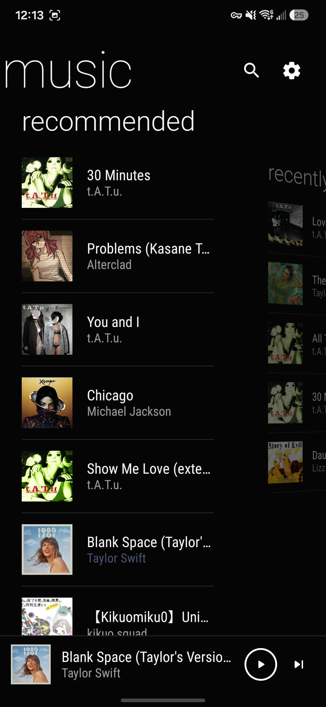
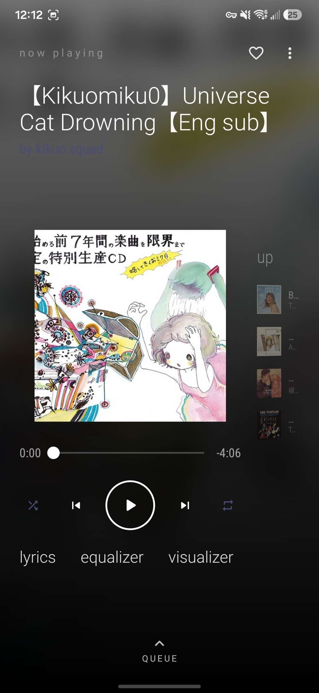
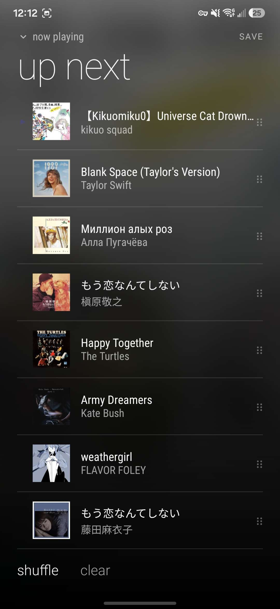
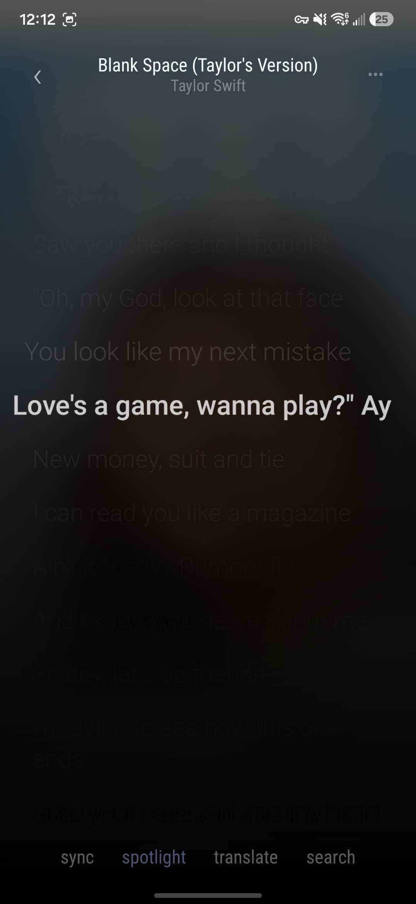

# Prism

An Android music player for Navidrome / Subsonic, built with Jetpack Compose.

  
  
  
  

## Features

- **Now Playing** — blurred album art backdrop, 3D panorama "up next" pane with perspective tilt
- **Queue** — drag-to-reorder, pull-down-to-close, shuffle that reshuffles on each repeat lap (never interrupts playback)
- **Lyrics** — karaoke highlight with smooth gradient sweep, auto-scroll that stops when you scroll manually, sync button to jump back to the current line
- **Visualizer** — ferrofluid blob (FFT-driven rim), mirrored spectrum bars, wave, and ring modes
- **Lyric sources** — LRCLIB (synced), Netease (synced), Genius (text), lyrics.ovh (text); configurable per-source in Settings
- **Generated cover art** — procedural gradient covers for songs with no artwork
- **Equalizer** — per-band EQ with presets
- **Mini player** — persistent bottom bar with play/skip controls

## Stack

- Kotlin + Jetpack Compose (BOM 2025.02)
- Media3 / ExoPlayer for playback
- Coil for image loading
- Retrofit + Subsonic API for library browsing and streaming
- `SharedPreferences`-backed `StateFlow` for settings

## Setup

1. Clone the repo and open in Android Studio.
2. Build and install on a device or emulator running Android 8.0+.
3. On first launch, enter your Navidrome server URL, username, and password.

> The app talks the Subsonic REST API, so any Subsonic-compatible server (Navidrome, Airsonic, Funkwhale in compat mode, etc.) works.

## License

[MIT](LICENSE.md)
